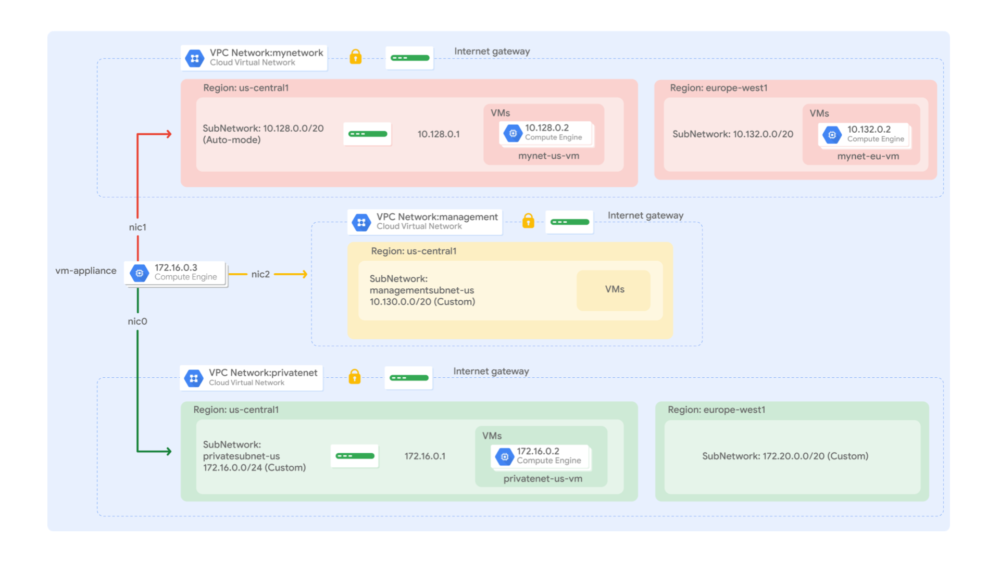

# Set Up and Configure a Cloud Environment in Google Cloud

### Tasks:
1.
2.
3. Multiple VPC Networks
4. 

### 1.

### 2.

### 3. Multiple VPC Networks
#### Overview
In this lab you create several VPC networks and VM instances and test connectivity across networks. Specifically, you create two custom mode networks (managementnet and privatenet) with firewall rules and VM instances as shown in this network diagram:

The **mynetwork** network with its firewall rules and two VM instances (**mynet-{Region}-vm** and **mynet-{Region}-vm**) have already been created for you for this lab.

#### Objectives
In this lab, you will learn how to perform the following tasks:

 - Create custom mode VPC networks with firewall rules
 - Create VM instances using Compute Engine
 - Explore the connectivity for VM instances across VPC networks
 - Create a VM instance with multiple network interfaces

#### Task 1. Create custom mode VPC networks with firewall rules
Create two custom networks **managementnet** and **privatenet**, along with firewall rules to allow **SSH**, **ICMP**, and **RDP** ingress traffic.

**Create the managementnet network**

Create the managementnet network using the Cloud Console.

1. In the Cloud Console, navigate to Navigation menu (**Navigation menu** ) > **VPC network** > **VPC networks**.

2. Notice the **default** and **mynetwork** networks with their subnets.

   Each Google Cloud project starts with the **default** network. In addition, the **mynetwork** network has been premade as part of your network diagram.

3. Click **Create VPC Network**.

4. Set the Name to ``managementnet``.

5. For **Subnet creation mode**, click **Custom**.

6. Set the following values, leave all other values at their defaults:

**Create the privatenet network**
**Create the firewall rules for managementnet**
**Create the firewall rules for privatenet**

#### Task 2. Create VM instances
Create two VM instances:
-
-

**Create the managementnet--vm instance**
**Create the privatenet--vm instance**

#### Task 3. Explore the connectivity between VM instances

Explore the connectivity between the VM instances. Specifically, determine the effect of having VM instances in the same zone versus having instances in the same VPC network.

**Ping the external IP addresses**

Ping the external IP addresses of the VM instances to determine if you can reach the instances from the public internet.

**Ping the external IP addresses**

#### Task 4. Create a VM instance with multiple network interfaces

Every instance in a VPC network has a default network interface. You can create additional network interfaces attached to your VMs. Multiple network interfaces enable you to create configurations in which an instance connects directly to several VPC networks (up to 8 interfaces, depending on the instance's type).

**Create the VM instance with multiple network interfaces**
**Explore the network interface detail**
**Explore the network interface connectivity**

### 4.

